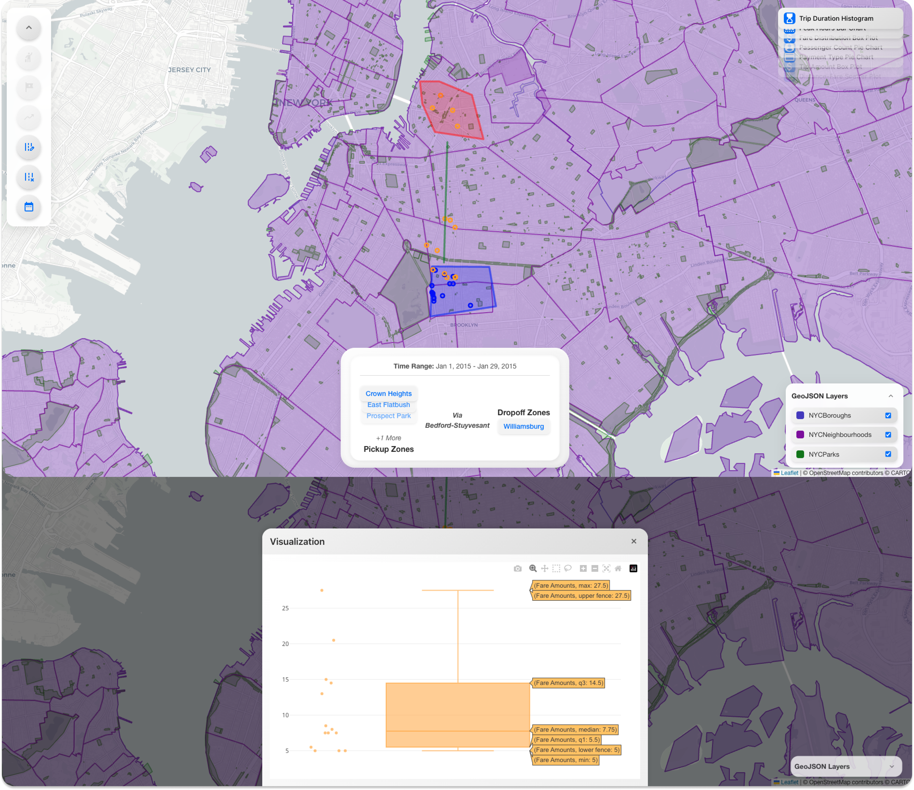

<div align="center">
  
  <h1><strong>Taxis Vis</strong></h1>
  <h4>Frontend-side 🎨</h4>


</div>

______

<div align="center">

_Greetings_ from the **Taxis Vis Frontend**! This project is a component of the larger **Taxis Vis** initiative, which
draws inspiration from the paper [*Visual Exploration of Big Spatio-Temporal Urban Data: A Study of New York City Taxi
Trips*](https://ieeexplore.ieee.org/abstract/document/6634127/).
We aim to _revive_ the paper using _modern_ open-source tools.

</div>


<div align="center">
  
</div>

## 🚀 **Overview**

With geo-spatial insights and interactive visualisations, the Taxis Vis Frontend is the user
interface for investigating and evaluating taxi trip data while working with two computational-based backends
discussed later. Though it is **proof-of-concept** and by far _does not cover all the features discussed in the paper_,
the following first _alpha_ version is nevertheless important to show that it is _feasible_ without high-hurdles.

### 🌍 **GeoSpatial Viz. & Computation**

| **Feature**                       | **Notes**                                                                                    |
|-----------------------------------|----------------------------------------------------------------------------------------------|
| **Spatial Selections**            | Simple **Pickup** &or; **Dropoff** zones using polygon drawings.                             |
| **Spatial Queries (SQ)**          | Combine **Pickup** &and; **Dropoff**, as well as with directional lines using a buffer zone. |
| **SQ &cup; Temporal Constraints** | Apply **time filters** to all types of Spatial Queries (**SQ**).                             |

### 📊 **Data Analysis**

> [!IMPORTANT]
> The following are not taken from the paper. They are simply available to show the capability of the backend to provide
> insights and data analysis. Further development is possible to match the paper's _exact_ features.

| **Feature**                            | **Notes**                                                        |
|----------------------------------------|------------------------------------------------------------------|
| 🕒 **Trip Duration Histogram**         | Visualises the distribution of trip durations.                   |
| 📊 **Peak Hours Bar Chart**            | Highlights the busiest hours of the day.                         |
| 📦 **Fare Distribution Box Plot**      | Displays the range and distribution of fares.                    |
| 🧑‍🤝‍🧑 **Passenger Count Pie Chart** | Breaks down trips by passenger count.                            |
| 💳 **Payment Type Pie Chart**          | Shows the proportions of different payment methods.              |
| 💸 **Tip Amount Analysis**             | Analyses tips provided by passengers.                            |
| 🚗 **Distance-Fare Scatter Plot**      | Explores the relationship between trip distance and fare amount. |
| 📈 **Time Series Line Graph**          | Displays trends over time.                                       |

---

### 🚀 **Technology Stack**

#### **Frontend**

| **Feature**              | **Details**                                                                                                                                                                                                                                                                                                                                                                                                                                                            |
|--------------------------|------------------------------------------------------------------------------------------------------------------------------------------------------------------------------------------------------------------------------------------------------------------------------------------------------------------------------------------------------------------------------------------------------------------------------------------------------------------------|
| **Framework**            | React.js _(version: 19.0.0)_ [](https://github.com/facebook/react)                                                                                                                                                                                                                                                                                                                |
| **GeoSpatial Mapping**   | Leaflet with React-Leaflet for map (navigation/drawing/interactions) management & smoothness enhancements, comparable to MapLibre for enhanced navigation. <br>- [Leaflet ](https://github.com/Leaflet/Leaflet) <br>- [React-Leaflet ](https://github.com/PaulLeCam/react-leaflet) |
| **Graph Visualisations** | Plotly.js for dynamic graph visualisations [](https://github.com/plotly/plotly.js)                                                                                                                                                                                                                                                                                              |

---

#### **Backend: GeoSpatial Computation**

| **Feature**                | **Details**                                                                                                                                                       |
|----------------------------|-------------------------------------------------------------------------------------------------------------------------------------------------------------------|
| **Framework**              | Node.js with V8 Multi-Threaded Engine [](https://github.com/nodejs/node)        |
| **GeoSpatial Computation** | Turf.js for advanced spatial data processing [](https://github.com/Turfjs/turf) |

---

#### **Backend: Data Analysis**

| **Feature**              | **Details**                                                                                                                                                                      |
|--------------------------|----------------------------------------------------------------------------------------------------------------------------------------------------------------------------------|
| **Framework**            | Python (Django) [](https://github.com/django/django)                                         |
| **Data Analysis**        | Pandas for flexible and efficient data handling [](https://github.com/pandas-dev/pandas) |
| **Numerical Processing** | NumPy for foundational numerical computations [](https://github.com/numpy/numpy)               |

## Limitations 🚧

The **Taxis Vis** project, like any Proof-of-Concept, has limitations that are outlined below for
transparency and improvement opportunities:

| **Limitation**          | **Details**                                                                                                                                                                                                                                                                                                                               |
|-------------------------|-------------------------------------------------------------------------------------------------------------------------------------------------------------------------------------------------------------------------------------------------------------------------------------------------------------------------------------------|
| **Dataset Dependency**  | The project heavily relies on the structure of the current dataset/database used so far (see below). To improve flexibility, the system should support configurable column mappings for any taxi trip database.                                                                                                                           |
| **Platform Testing**    | Currently tested only on 🍎 **macOS Sequoia** on an Apple Silicon-based machine. Compatibility with Linux is anticipated, but functionality on Windows remains unverified.                                                                                                                                                                |
| **Database Efficiency** | Database management may not be optimised for maximum performance (yet!). Future exploration could benefit from integrating  **[DuckDB](https://github.com/duckdb/duckdb)**, a high-performance analytical database engine with the following stars: . |

## 📦 **Installation**

### **Pre-requisites**

- **Node.js** installed on your system.
- **npm** package manager installed.

### **Frontend Setup**

1. Clone the repository.
   ```bash
   git clone https://github.com/VIDA-NYU/Taxis-Vis-Frontend.git
   cd Taxis-Vis-Frontend
   ```
2. Install dependencies.
   ```bash
   npm install
   ```
3. Start the development server.
   ```bash
   npm start
   ```

<details>
<summary>🔗 Backend Dependencies ⏭️ MANDATORY ⏮️ </summary>

### **Pre-requisites**

- **Python** installed on your system.
- **pip** package manager installed.
- **uv** package installed.
- **Node.js** installed on your system.
- **npm** package manager installed.

### ⚙️ **Backend Setup**

#### **GeoSpatial Backend**

Read first ➡️ [GeoSpatial Backend](https://github.com/VIDA-NYU/Taxis-Vis-Geospatial-Backend)

1. Install Node.js on your machine.
2. Navigate to the GeoSpatial Backend directory and run:
   ```bash
   npm install
   ```
3. Start the server with:
   ```bash
   node server.js
   ```

#### **Data Analysis Backend**

Read first ➡️ [Data Analysis Backend](https://github.com/VIDA-NYU/Taxis-Vis-Data-Backend)

1. Lock and Sync the backend with the following commands:
   ```bash
   uv lock
   uv sync
   ```

2. Start the server with:
   ```bash
   uv run python manage.py runserver
   ```

</details>

> [!IMPORTANT]
> If you have none of the aforementioned backends, you can still run the frontend yet interactive
> features will not work.

---

## Design Philosophy 💡

The **Taxis Vis** project builds on the Taxis Vis paper's insights with a structured, future-proof approach and modern
technology stack. Our philosophy is based on three main principles:

### **1. Embracing Flexibility and Open Source Tools**

We prefer flexible, open-source tools that can be easily adapted to a wide range of use cases. The tools used in this
project are carefully chosen based on:

- **Community Support**: A large number of GitHub stars.
- **Active Maintenance**: Recent commits to increase chances for long-term viability.
- **Ease of Use**: APIs that are simple, intuitive, and/or heavy on features, allowing for rapid development.

## **2. Combining Tools to Gain Complex Insights**

The paper's capabilities require multiple tools, such as spatial selections, queries, and temporal constraints.
There is no single open-source solution that, to the best of the authors' knowledge, provides all of these capabilities
out of the box.
**Taxis Vis** utilises various technologies to replicate and enhance the paper's functionality.

### **3. Creating Generic and Reusable Components**

This project seeks – in parallel of reproducing the so-chosen paper – to abstract and generalise components for reuse in
the urban research community,
including **@VIDA-NYU**. Consider the **customisable toolbar**: Leaflet and react-Leaflet provides basic
drawing and spatial querying, but lacks easy customisation and event handling.
We can think contributing to the urban analytics community by developing a reusable, modular toolbar for spatial
selection and queries – While relying on Leaflet and react-Leaflet for the core functionality which are widely used and
well-maintained.

Scale this to all the other components, and we have a powerful, flexible, and reusable set of tools for urban analytics
research.

### Cheers! 🎉

---

## Cite the Paper _we are reproducing_ 📜

> @ARTICLE{6634127,  
> author={Ferreira, Nivan and Poco, Jorge and Vo, Huy T. and Freire, Juliana and Silva, Cláudio T.},  
> journal={IEEE Transactions on Visualization and Computer Graphics},   
> title={Visual Exploration of Big Spatio-Temporal Urban Data: A Study of New York City Taxi Trips},   
> year={2013},  
> volume={19},  
> number={12},  
> pages={2149-2158},  
> keywords={Visual analytics; Cities and towns; Data visualization; Data models; Analytical models; Time factors;
> Mathematical model; Visual exploration; Spatio-temporal queries; Urban data; NYC taxis},  
> doi={10.1109/TVCG.2013.226}  
> }

## Dataset Used So Far for the Proof-Of-Concept (POC) 📊

For this POC, we use a publicly available dataset of New York City taxi trips
from [Kaggle: NYC Yellow Taxi Trip Data](https://www.kaggle.com/datasets/elemento/nyc-yellow-taxi-trip-data).

> This dataset has a similar structure and insights into NYC taxi trips, which align with the
**Taxis Vis** project's goals, but it is not the same dataset (yet!). Future work will use the very same
> data from the paper and improve the use of its _own_ data, as it currently adheres to current data schematics.

🔗 [Explore the dataset on Kaggle](https://www.kaggle.com/datasets/elemento/nyc-yellow-taxi-trip-data)

## 📖 **Explore Further**

| **Resource**              | **Link**                                                                                          |
|---------------------------|---------------------------------------------------------------------------------------------------|
| **GeoSpatial Backend**    | [VIDA-NYU Taxis Vis GeoSpatial Backend](https://github.com/VIDA-NYU/Taxis-Vis-Geospatial-Backend) |
| **Data Analysis Backend** | [VIDA-NYU Taxis Vis Data Backend](https://github.com/VIDA-NYU/Taxis-Vis-Data-Backend)             |

---

**Happy Exploring! 🎉**
