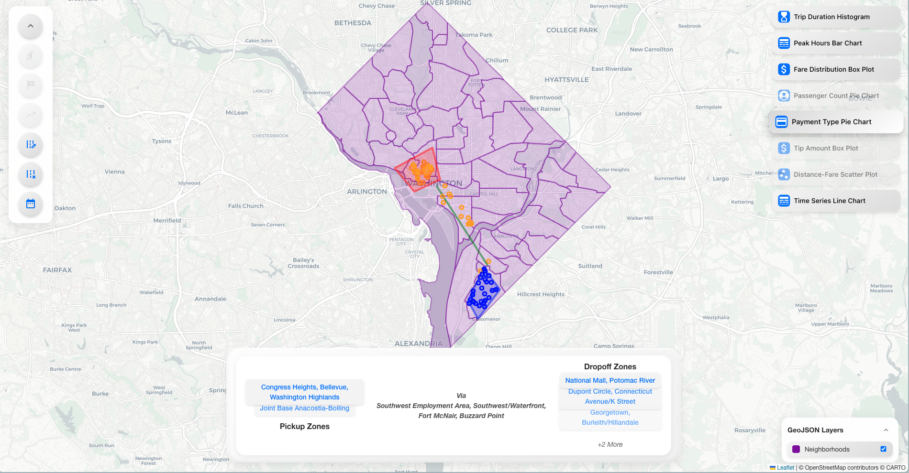

__# DC Example: Importing GeoJSON and Creating DuckDB Database



## ⏭️ **Setup Configuration (For Reproduction)**

- **Node.js Version**: []
- **React Version**: []
- **Python Version**: []
- **DuckDB Version**: []

The rest of the setup is detailed per the `package.json` and `pyproject.toml` files in the respective directories.

- **OSX Sequoia**: []
- **RAM**: []
- **CPU Chip**: []

## 📍 **Overview**

This example demonstrates how to import Washington DC taxi trip data, convert the dataset, create a DuckDB database, and
configure both the **Frontend** and **GeoSpatial Backend** for DC-specific data. Follow the steps below to replicate
this setup.

> [!NOTE]
> We assume that you have `node`, `react`, `python`, and `duckDB` installed on your local machine!

## 🚀 **Steps to Import DC Taxi Data**

### 1. **Download the DC Taxi Trips Dataset
** 

Download the CSV dataset of taxi trips in Washington DC from [this link](https://dcgov.app.box.com/v/taxi-trips-2019).
For this example, we will use the `taxi_2019_01.txt` file for January 2019.

### 2. **Rename the File Extension
** 

Move and rename the `.txt` file to `.csv`:

```bash
mv taxi_2019_01.txt taxi_2019_01.csv
```

### 3. **Convert Pipe-Separated to Comma-Separated CSV
** 

Use the following Python script to convert the pipe-separated `.csv` file to a comma-separated `.csv`. This is necessary
because DuckDB expects comma-separated values for proper parsing.

```python
import pandas as pd
from datetime import datetime, timedelta


def convert_pipe_to_comma(input_file, output_file):
    df = pd.read_csv(input_file, sep='|', dtype=str)

    df['tpep_pickup_datetime'] = pd.to_datetime(df['ORIGINDATETIME_TR'], format='%m/%d/%Y %H:%M')

    df['DURATION'] = pd.to_numeric(df['DURATION'], errors='coerce')
    df['tpep_dropoff_datetime'] = df['tpep_pickup_datetime'] + pd.to_timedelta(df['DURATION'], unit='s')

    df.drop(columns=['ORIGINDATETIME_TR', 'DESTINATIONDATETIME_TR'], inplace=True)

    df.to_csv(output_file, index=False, sep=',')

    print(f'File saved successfully: {output_file}')


# Example usage

input_file = '/path/to/taxi_dc_2019_01.csv'  # Replace with the actual filename
output_file = 'taxi_dc_2019_01_convert.csv'  # Desired output filename
convert_pipe_to_comma(input_file, output_file)
```

> [!IMPORTANT]
> **Why Convert?**  
> DuckDB efficiently handles comma-separated values. Converting ensures that all data is correctly parsed and stored,
> enabling seamless integration with the backend services.

### 4. **Download DC Neighborhoods GeoJSON
**  && 

Download the GeoJSON file for DC neighborhoods
from [this repository](https://github.com/benbalter/dc-maps/blob/master/maps/neighborhood-clusters.geojson).

> [!NOTE]
> Funny enough, this is not an accurate representation of DC neighborhoods, rather it is a cluster of neighborhoods. But
> it serves the purpose of this example because more accurate GeoJSON seems to need to be purchased. See
> more [here](https://simplemaps.com/city/washington/neighborhoods).

1) Move the downloaded GeoJSON file to the `public/geojson/DC` directory in
   the .

```bash
mv neighborhood-clusters.geojson /path/to/taxis-vis-frontend/public/geojson/DC/neighborhoods.geojson
```

2) Move the downloaded GEOJSON file to the `public/geojson/DC` directory in
   the .

```bash
mv neighborhood-clusters.geojson /path/to/taxis-vis-geospatial-backend/public/geojson/DC/neighborhoods.geojson
```

### 5. **Configure the Frontend `mapConfig.json`** 

Update the `mapConfig.json` file in the frontend to include the DC neighborhoods GeoJSON.

```json
{
  "mapSettings": {
    "tileLayer": "cartoLight",
    "center": [
      38.9072,
      -77.0369
    ],
    "zoom": 11
  },
  "geoJsonLayers": [
    {
      "id": "neighborhoods-layer",
      "name": "Neighborhoods",
      "url": "/geojson/DC/neighborhoods.geojson",
      "style": {
        "color": "#8206a9",
        "weight": 2,
        "opacity": 0.5
      }
    }
  ]
}
```

> [!IMPORTANT]
> **Note**: The `center` coordinates are set to Washington DC's latitude and longitude. Adjust them if necessary.

### 6. **Create the DuckDB Database** 

Follow the instructions in
the [GeoSpatial Computation Backend README](https://github.com/VIDA-NYU/Taxis-Vis-Geospatial-Backend#installation--setup)
to import the converted CSV into DuckDB.

```sql
-- Open DuckDB CLI
duckdb
.
/data/taxis_dc.duckdb

-- Install & Load Spatial extension
INSTALL spatial;
LOAD
spatial;

-- Import CSV into DuckDB
CREATE TABLE trips AS
SELECT *
FROM read_csv(
        '/path/to/taxi_dc_2019_01_convert.csv',
        columns ={
            'OBJECTID': 'INTEGER',
        'TRIPTYPE': 'VARCHAR',
        'PROVIDERNAME': 'VARCHAR',
        'FAREAMOUNT': 'DOUBLE',
        'GRATUITYAMOUNT': 'DOUBLE',
        'SURCHARGEAMOUNT': 'DOUBLE',
        'EXTRAFAREAMOUNT': 'DOUBLE',
        'TOLLAMOUNT': 'DOUBLE',
        'TOTALAMOUNT': 'DOUBLE',
        'PAYMENTTYPE': 'INTEGER',
        'ORIGINCITY': 'VARCHAR',
        'ORIGINSTATE': 'VARCHAR',
        'ORIGINZIP': 'VARCHAR',
        'DESTINATIONCITY': 'VARCHAR',
        'DESTINATIONSTATE': 'VARCHAR',
        'DESTINATIONZIP': 'VARCHAR',
        'MILEAGE': 'DOUBLE',
        'DURATION': 'INTEGER',
        'ORIGIN_BLOCK_LATITUDE': 'DOUBLE',
        'ORIGIN_BLOCK_LONGITUDE': 'DOUBLE',
        'ORIGIN_BLOCKNAME': 'VARCHAR',
        'DESTINATION_BLOCK_LATITUDE': 'DOUBLE',
        'DESTINATION_BLOCK_LONGITUDE': 'DOUBLE',
        'DESTINATION_BLOCKNAME': 'VARCHAR',
        'AIRPORT': 'VARCHAR',
        'tpep_pickup_datetime': 'TIMESTAMP',
        'tpep_dropoff_datetime': 'TIMESTAMP' },
      timestampformat='%Y-%m-%d %H:%M:%S'
  );

-- Add GeoJSON Point columns
ALTER TABLE trips
    ADD COLUMN pickup JSON;
ALTER TABLE trips
    ADD COLUMN dropoff JSON;

UPDATE trips
SET pickup  = json('{"type":"Point","coordinates":[' || ORIGIN_BLOCK_LONGITUDE || ',' || ORIGIN_BLOCK_LATITUDE || ']}'),
    dropoff = json('{"type":"Point","coordinates":[' || DESTINATION_BLOCK_LONGITUDE || ',' ||
                   DESTINATION_BLOCK_LATITUDE || ']}');

-- Create indexes for faster queries
CREATE INDEX idx_pickup_time ON trips (tpep_pickup_datetime);
CREATE INDEX idx_dropoff_time ON trips (tpep_dropoff_datetime);

-- Exit DuckDB CLI
.exit
```

> [!NOTE]
> **Tip**: Ensure that the column names in the `read_csv` function match exactly with your CSV headers for seamless data
> import.

### 7. **Configure Backend `config.json` and `dataset.json`
** 

Modify the backend configuration files to point to the DC DuckDB database and GeoJSON.

#### `config.json`

```json
{
  "database": {
    "duckdbPath": "./data/taxis_dc.duckdb",
    "tripsTableName": "trips",
    "databaseDescription": "./config/dataset.json",
    "accessMode": "READ_ONLY",
    "extensions": [
      "spatial"
    ]
  },
  "geojson": {
    "filePath": "./public/geojson/DC/neighborhoods.geojson",
    "neighborhoodNameKeys": [
      "NBH_NAMES"
    ]
  }
}
```

#### `dataset.json`

```json
{
  "data_analysis_backend_required_columns": [
    "trip_distance",
    "fare_amount",
    "payment_type",
    "tip_amount",
    "passenger_count",
    "pickup_datetime",
    "dropoff_datetime"
  ],
  "geospatial_backend_location_columns": {
    "pickup": "pickup",
    "dropoff": "dropoff"
  },
  "geospatial_backend_datetime_columns": {
    "pickup": "tpep_pickup_datetime",
    "dropoff": "tpep_dropoff_datetime"
  },
  "filtered_trips_output_columns": {
    "trip_distance": "trip_distance",
    "fare_amount": "FAREAMOUNT",
    "payment_type": "PAYMENTTYPE",
    "tip_amount": "tip_amount",
    "passenger_count": "passenger_count",
    "pickup_datetime": "tpep_pickup_datetime",
    "dropoff_datetime": "tpep_dropoff_datetime",
    "OBJECTID": "OBJECTID",
    "TRIPTYPE": "TRIPTYPE",
    "PROVIDERNAME": "PROVIDERNAME",
    "gratuity_amount": "GRATUITYAMOUNT",
    "surcharge_amount": "SURCHARGEAMOUNT",
    "extra_fare_amount": "EXTRAFAREAMOUNT",
    "toll_amount": "TOLLAMOUNT",
    "total_amount": "TOTALAMOUNT",
    "origin_city": "ORIGINCITY",
    "origin_state": "ORIGINSTATE",
    "origin_zip": "ORIGINZIP",
    "destination_city": "DESTINATIONCITY",
    "destination_state": "DESTINATIONSTATE",
    "destination_zip": "DESTINATIONZIP",
    "mileage": "MILEAGE",
    "duration": "DURATION",
    "pickup_longitude": "ORIGIN_BLOCK_LONGITUDE",
    "pickup_latitude": "ORIGIN_BLOCK_LATITUDE",
    "pickup_block_name": "ORIGIN_BLOCKNAME",
    "dropoff_longitude": "DESTINATION_BLOCK_LONGITUDE",
    "dropoff_latitude": "DESTINATION_BLOCK_LATITUDE",
    "dropoff_block_name": "DESTINATION_BLOCKNAME",
    "airport": "AIRPORT",
    "pickup": "pickup",
    "dropoff": "dropoff"
  }
}
```

> [!CAUTION]
> **Ensure Consistency**: The keys in `filtered_trips_output_columns` should match the
`data_analysis_backend_required_columns`. This ensures seamless data flow between the frontend and the data analysis
> backend.

### 8. **Finalise and Restart Services
**  

After completing the above configurations:

1. **Restart the Node.js Geospatial Backend** to apply the new configurations.
   ```bash
   node server.js
   ```

2. **Restart the npm React Frontend** to apply the new configurations.
   ```bash
   npm run start
   ```

3. **Verify the Frontend** is correctly pointing to the new GeoJSON and DuckDB database.

4. **Run The Data Analysis Backend**: `uv run python manage.py runserver` to start the Django server for data
   analysis. 

---

**Happy Exploring!**  
_The Taxis Vis Team___
