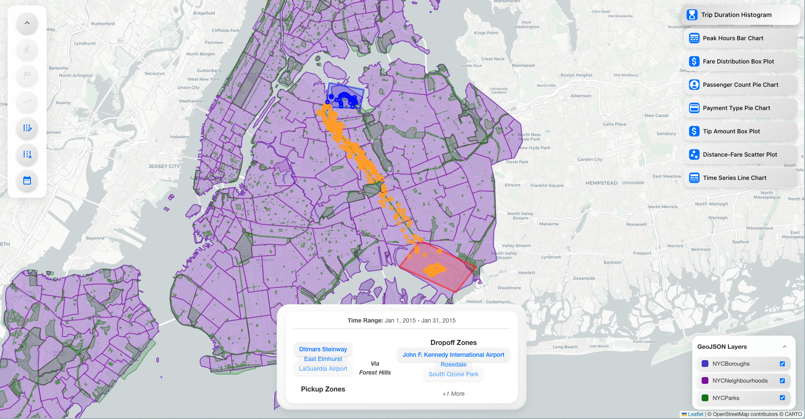

# NYC Example: Importing GeoJSON and Creating DuckDB Database



## ⏭️ Setup Configuration (For Reproduction)

- **Node.js Version**: []
- **React Version**: []
- **Python Version**: []
- **DuckDB Version**: []
- **OSX Sequoia**: []
- **RAM**: []
- **CPU Chip**: []

The rest of the setup is detailed per the `package.json` and `pyproject.toml` files in the respective directories.

## 📍 Overview

This example demonstrates how to import **New York City** taxi trip data, (optionally) sample rows, create a DuckDB
database, and configure both the **Frontend** and **GeoSpatial Backend** for NYC-specific data. Follow the steps below
to replicate this setup.

> [!NOTE]
> We assume that you have `node`, `react`, `python`, and `duckDB` installed on your local machine!

## 🚀 Steps to Import NYC Taxi Data

### 1. Download the NYC Taxi Trips Dataset


Visit
the [NYC Open Data Portal (2015 Yellow Taxi Trip Data)](https://data.cityofnewyork.us/Transportation/2015-Yellow-Taxi-Trip-Data/2yzn-sicd/data).

1. Click the **Export** button on the right.
2. Select **CSV** to download.
3. You can optionally limit or filter if you prefer, or you can download the entire dataset.

> [!NOTE]
> There appear to be a couple of "outliers" data points in the dataset. Making it sometime popping some data poin in the
> middle of the ocean hence moving the "camera view" crazy far away. We could "clean" the data but for the sake of the POC
> we have not. Simply zoom back in NYC.
>

### 2. (Optional) Extract a Subset of Rows


If you want to avoid huge local queries (the dataset can be very large), you can sample out, e.g., 100K or 1M rows:

```python
import pandas as pd
import argparse
import sys

def extract_rows_pandas(input_csv, output_csv, num_rows):
    try:
        df = pd.read_csv(input_csv, nrows=num_rows)
        df.to_csv(output_csv, index=False)
        print(f"Successfully extracted {num_rows} rows to '{output_csv}'.")
    except FileNotFoundError:
        print(f"Error: The file '{input_csv}' does not exist.")
    except pd.errors.EmptyDataError:
        print(f"Error: The file '{input_csv}' is empty.")
    except Exception as e:
        print(f"An unexpected error occurred: {e}")

def main():
    parser = argparse.ArgumentParser(description="Extract N rows from a CSV file and create a duplicate.")
    parser.add_argument("input_csv", help="Path to the input CSV file.")
    parser.add_argument("output_csv", help="Path to the output CSV file.")
    parser.add_argument("num_rows", type=int, help="Number of rows to extract.")
    args = parser.parse_args()
    extract_rows_pandas(args.input_csv, args.output_csv, args.num_rows)

if __name__ == "__main__":
    main()
```

**Example usage**:

```bash
uv run python extract_rows_pandas.py taxisbig.csv taxisvis1M.csv 1000000
```

*(This extracts 1 million rows from `taxisbig.csv` to `taxisvis1M.csv`.)*

### 3. Download NYC GeoJSON Layers 

We provide three layers you can store in `public/geojson/NYC/`:

1. Boroughs
   : [NYC Boroughs GeoJSON](https://github.com/codeforgermany/click_that_hood/blob/main/public/data/new-york-city-boroughs.geojson)
   2. Neighborhoods
   : [NYC Neighborhoods GeoJSON](https://data.dathere.com/dataset/nyc-neighborhoods/resource/d6db2e12-fc58-4e41-bc58-5bdfb5078131)
   3. Parks: [NYC Parks Properties](https://data.cityofnewyork.us/Recreation/Parks-Properties/enfh-gkve/about_data)

Download and save them as follows:

```bash
mkdir -p public/geojson/NYC
curl -o public/geojson/NYC/boroughs.geojson  <Boroughs_Url>
curl -o public/geojson/NYC/neighborhoods.geojson <Neighborhoods_Url>
curl -o public/geojson/NYC/parks.geojson <Parks_Url>
```

### 3.BIS Download only the Neighborhoods GeoJson for the Node.JS Backend


We provide the Neighborhoods GeoJSON layer you can store in `public/geojson/NYC/`:

1. Neighborhoods
   : [NYC Neighborhoods GeoJSON](https://data.dathere.com/dataset/nyc-neighborhoods/resource/d6db2e12-fc58-4e41-bc58-5bdfb5078131)

Download and save it as follows:

```bash
mkdir -p public/geojson/NYC

curl -o public/geojson/NYC/neighborhoods.geojson <Neighborhoods_Url>
```

### 4. Configure the Frontend `mapConfig.json` (NYC) 

The `mapConfig.json` file defines the default map settings and layers.  
Instead of hardcoding coordinates and styles, you can leverage predefined **tile layers** from [
`src/utils/tiles_layers.json`](../src/utils/tiles_layers.json) and city centers from [
`src/utils/cities_centers.json`](../src/utils/cities_centers.json).

#### Example Using Predefined Tile Layer and City Center:
```json
{
  "mapSettings": {
     "tileLayer": "streets-v12-2D",
     "center": "nyc",
    "zoom": 11
  },
  "geoJsonLayers": [
    {
      "id": "nyc-layer",
      "name": "NYCBoroughs",
      "url": "/geojson/NYC/boroughs.geojson",
      "style": {
        "color": "#4E3FC8",
        "weight": 2,
        "opacity": 0.5
      }
    },
    {
      "id": "nyc-neighbourhoods-layer",
      "name": "NYCNeighbourhoods",
      "url": "/geojson/NYC/neighborhoods.geojson",
      "style": {
        "color": "#8206a9",
        "weight": 2,
        "opacity": 0.5
      }
    },
    {
      "id": "nyc-parks-layer",
      "name": "NYCParks",
      "url": "/geojson/NYC/parks.geojson",
      "style": {
        "color": "#298008",
        "weight": 2,
        "opacity": 0.5
      }
    }
  ]
}
```

#### Example Using a Custom Mapbox Style and Explicit Coordinates:

```json
{
   "mapSettings": {
      "tileLayer": "mapbox://styles/your-custom-style-url",
      "center": [
         40.7128,
         -74.0060
      ],
      "zoom": 11
   }
}
```

> [!NOTE]
> - If `"center": "nyc"` is set, the system automatically retrieves NYC’s coordinates from `cities_centers.json`.
> - The **tile layer** can be a custom Mapbox style URL or a predefined key from `tiles_layers.json`.
> - Multiple layers can be included under `geoJsonLayers`, and the UI allows toggling them on/off.

### 5. Create the DuckDB Database 

Follow the instructions in
the [GeoSpatial Computation Backend README](https://github.com/VIDA-NYU/Taxis-Vis-Geospatial-Backend#installation--setup)
to import your chosen CSV (or partial CSV) into DuckDB. In DuckDB CLI:

```sql
-- Open DuckDB CLI
duckdb
.
/data/taxis_nyc.duckdb

-- Install & Load spatial
INSTALL spatial;
LOAD
spatial;

-- Import CSV into DuckDB (adjust path if you used partial extract, e.g. taxisvis1M.csv)
CREATE TABLE trips AS
SELECT *
FROM read_csv(
        '/path/to/taxisvis1M.csv',
        columns ={
            'VendorID': 'INTEGER',
        'tpep_pickup_datetime': 'TIMESTAMP',
        'tpep_dropoff_datetime': 'TIMESTAMP',
        'passenger_count': 'INTEGER',
        'trip_distance': 'DOUBLE',
        'pickup_longitude': 'DOUBLE',
        'pickup_latitude': 'DOUBLE',
        'RateCodeID': 'INTEGER',
        'store_and_fwd_flag': 'VARCHAR',
        'dropoff_longitude': 'DOUBLE',
        'dropoff_latitude': 'DOUBLE',
        'payment_type': 'INTEGER',
        'fare_amount': 'DOUBLE',
        'extra': 'DOUBLE',
        'mta_tax': 'DOUBLE',
        'tip_amount': 'DOUBLE',
        'tolls_amount': 'DOUBLE',
        'improvement_surcharge': 'DOUBLE',
        'total_amount': 'DOUBLE' },
      timestampformat='%Y-%m-%d %H:%M:%S'
  );

-- Add GeoJSON Point columns
ALTER TABLE trips
    ADD COLUMN pickup JSON;
ALTER TABLE trips
    ADD COLUMN dropoff JSON;

UPDATE trips
SET pickup  = json('{"type":"Point","coordinates":[' || pickup_longitude || ',' || pickup_latitude || ']}'),
    dropoff = json('{"type":"Point","coordinates":[' || dropoff_longitude || ',' || dropoff_latitude || ']}');

-- Create indexes for faster queries
CREATE INDEX idx_pickup_time ON trips (tpep_pickup_datetime);
CREATE INDEX idx_dropoff_time ON trips (tpep_dropoff_datetime);

-- Exit DuckDB
.exit
```

> [!NOTE]
> **Tip**: If your CSV includes additional columns or uses different naming, update them in `columns={ ... }`.

### 6. Configure Backend `config.json` and `dataset.json`


In your Node.js geospatial backend, set:

#### `config.json`

```json
{
  "database": {
    "duckdbPath": "./data/taxis_nyc.duckdb",
    "tripsTableName": "trips",
    "databaseDescription": "./config/dataset.json",
    "accessMode": "READ_ONLY",
    "extensions": [
      "spatial"
    ]
  },
  "geojson": {
    "filePath": "./public/geojson/NYC/neighborhoods.geojson",
    "neighborhoodNameKeys": [
      "neighborhood"
    ]
  }
}
```

#### `dataset.json`

```json
{
  "data_analysis_backend_required_columns": [
    "trip_distance",
    "fare_amount",
    "payment_type",
    "tip_amount",
    "passenger_count",
    "pickup_datetime",
    "dropoff_datetime"
  ],
  "geospatial_backend_location_columns": {
    "pickup": "pickup",
    "dropoff": "dropoff"
  },
  "geospatial_backend_datetime_columns": {
    "pickup": "tpep_pickup_datetime",
    "dropoff": "tpep_dropoff_datetime"
  },
  "filtered_trips_output_columns": {
    "trip_distance": "trip_distance",
    "fare_amount": "fare_amount",
    "payment_type": "payment_type",
    "tip_amount": "tip_amount",
    "passenger_count": "passenger_count",
    "pickup_datetime": "tpep_pickup_datetime",
    "dropoff_datetime": "tpep_dropoff_datetime",
    "pickup": "pickup",
    "dropoff": "dropoff",
    "VendorID": "VendorID",
    "pickup_longitude": "pickup_longitude",
    "pickup_latitude": "pickup_latitude",
    "dropoff_longitude": "dropoff_longitude",
    "dropoff_latitude": "dropoff_latitude",
    "RateCodeID": "RateCodeID",
    "store_and_fwd_flag": "store_and_fwd_flag",
    "extra": "extra",
    "mta_tax": "mta_tax",
    "tolls_amount": "tolls_amount",
    "improvement_surcharge": "improvement_surcharge",
    "total_amount": "total_amount"
  }
}
```

> [!CAUTION]
> **Ensure Consistency**: The keys in `filtered_trips_output_columns` match the columns you actually have in DuckDB.
> Also note that `data_analysis_backend_required_columns` must not be removed if you plan to run the Data Analysis Backend
> for advanced charts.

### 7. Finalise and Restart

 

1. **Restart the Node.js Geospatial Backend**:
   ```bash
   node server.js
   ```

2. **Restart the npm React Frontend**:
   ```bash
   npm run start
   ```

3. **Verify** that the map loads NYC Boroughs, Neighborhoods, and Parks, and that your queries filter the taxi data from
   `taxis_nyc.duckdb`.

4. **(Optional) Data Analysis Backend**:  
   If you want to generate charts (histograms, box plots, etc.), run your Django-based analysis server:
   ```bash
   uv run python manage.py runserver
   ```

---

**Happy Exploring!**  
_The Taxis Vis Team_
